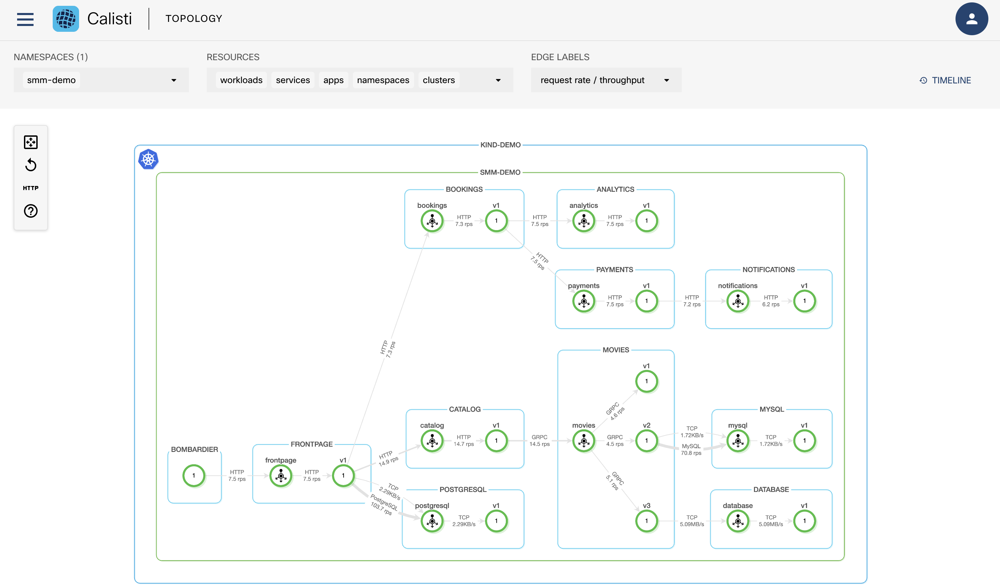

# Calisti Deployment on Kind

## Task 0. Allow multi-cluster

It could be required to run the following to add capacity if you need to install multiple cluster:

```bash
sudo sysctl fs.inotify.max_user_watches=524288
sudo sysctl fs.inotify.max_user_instances=512
```

## Task 1. Install Docker

As Kind is using Docker we need to install it on the host.

Please run the following

```bash
sudo apt update && sudo apt install docker.io -y
```

You should have an output similar to:

```console
Hit:1 http://us-west-2.ec2.archive.ubuntu.com/ubuntu jammy InRelease
Get:2 http://us-west-2.ec2.archive.ubuntu.com/ubuntu jammy-updates InRelease [114 kB]
...
No VM guests are running outdated hypervisor (qemu) binaries on this host.
```

Allow the user ubuntu to run docker:

```bash
sudo usermod -aG docker $USER && newgrp docker
```

and restart the web terminal demon to take changes into account for all terminal sessions:

```bash
sudo service ttyd restart
```

You should notice the web terminal is restarted.

## Task 2. Install Kind

Run the following commands to install Kind:

```bash
curl -Lo ./kind https://kind.sigs.k8s.io/dl/v0.15.0/kind-linux-amd64
chmod +x ./kind
sudo mv ./kind /usr/bin/kind
```

You should have an output similar to:


```console
  % Total    % Received % Xferd  Average Speed   Time    Time     Time  Current
                                 Dload  Upload   Total   Spent    Left  Speed
100    97  100    97    0     0    509      0 --:--:-- --:--:-- --:--:--   510
  0     0    0     0    0     0      0      0 --:--:-- --:--:-- --:--:--     0
100 6716k  100 6716k    0     0  6658k      0  0:00:01  0:00:01 --:--:-- 26.6M
```

## Task 3. Install Kubectl

Kubernetes provides a command line tool named `kubectl` for communicating with a Kubernetes cluster's control plane, using the Kubernetes API. For more information please refer to <https://kubernetes.io/docs/reference/kubectl/>.

Run the following to install `kubectl`:

```bash
sudo snap install kubectl --classic
```

You should have an output similar to:

```console
kubectl 1.25.1 from Canonical✓ installed
```

## Task 4. Install Kind cluster

Prepare cluster configuration file:

```bash
tee kind-config.yaml <<EOF                           
kind: Cluster
apiVersion: kind.x-k8s.io/v1alpha4
nodes:
- role: control-plane
- role: worker
- role: worker
EOF
```

In this lab we install a Kind cluster with Kubernetes v1.23, run the following command to deploy the cluster:

```bash
kind create cluster --name demo --config kind-config.yaml --image="kindest/node:v1.23.10@sha256:f047448af6a656fae7bc909e2fab360c18c487ef3edc93f06d78cdfd864b2d12"
```

You should have an output similar to:

```console
Creating cluster "demo" ...
 ✓ Ensuring node image (kindest/node:v1.23.10) 🖼 
 ✓ Preparing nodes 📦 📦 📦  
 ✓ Writing configuration 📜 
 ✓ Starting control-plane 🕹️ 
 ✓ Installing CNI 🔌 
 ✓ Installing StorageClass 💾 
 ✓ Joining worker nodes 🚜 
Set kubectl context to "kind-demo"
You can now use your cluster with:

kubectl cluster-info --context kind-demo

Not sure what to do next? 😅  Check out https://kind.sigs.k8s.io/docs/user/quick-start/
```

## Task 5. Install SMM CLI

To deploy Calisti SMM you need to download SMM CLI. Download the SMM CLI binary from <https://calisti.app/download>.

Then move the binary file in a folder included in your PATH:

```bash
tar -xvf smm_1.10.0_linux_amd64.tar
chmod +x ./smm
```

and restart the web terminal demon to take changes into account for all terminal sessions:

```bash
sudo service ttyd restart
```

## Task 6. Check SMM CLI is installed

```bash
./smm --version
```

```console 
Service Mesh Manager CLI version 1.10.0 (1d17b3310) built on 2022-08-04T20:15:29Z
```

## Task 7. Activate SMM with registry password

You need to activate SMM with the registration key/password generated on Calisti Download center at: <https://calisti.app/download>

```bash
SMM_REGISTRY_PASSWORD=REDACTED ./smm activate \
--host=registry.eticloud.io \
--prefix=smm \
--user=REDACTED
```

You should have an output similar to:

```console
? Are you sure to use the following context? kind-demo (API Server: https://127.0.0.1:40343) Yes
✓ validate-kubeconfig ❯ checking cluster reachability...
✓ Configuring docker image access for Service Mesh Manager.
✓ If you want to change these settings later, please use the 'registry' and 'activate' commands
```

## Task 8. Install SMM on Cluster

We will install SMM with Dashboard WebUI, prepare the configuration file:

```bash
tee enable-dashboard-expose.yaml <<EOF
spec:
  smm:
    exposeDashboard:
      meshGateway:
        enabled: true
    auth:
      forceUnsecureCookies: true
      mode: anonymous
EOF
```

Install SMM on the cluster with the config file for the Dashboard:

```bash
./smm --non-interactive install -a --additional-cp-settings ./enable-dashboard-expose.yaml --cluster-name kind-demo
```

Check the installation with:

```bash
./smm istio cluster status
```

You should have an output similar to:

```console
? Are you sure to use the following context? kind-demo (API Server: https://127.0.0.1:42005) (Y/n
? Are you sure to use the following context? kind-demo (API Server: https://127.0.0.1:42005) Yes
✓ validate-kubeconfig ❯ checking cluster reachability...
logged in as kubernetes-admin
Clusters
---
Name       Type   Provider  Regions  Version   Distribution  Status  Message  
kind-demo  Local  kind      []       v1.23.10  KIND          Ready            


ControlPlanes
---
Cluster    Name                   Version  Trust Domain     Pods                                             Proxies  
kind-demo  cp-v113x.istio-system  1.13.5   [cluster.local]  [istiod-cp-v113x-6db79d7d4d-lwsqk.istio-system]  22/22 
```

## Task 9. Install MetalLb loadbalancer

Since version 0.13.0, MetalLB is configured via CRs and the original way of configuring it via a ConfigMap based configuration is not working anymore. Run the following command to install MetalLb:

```bash
kubectl apply -f https://raw.githubusercontent.com/metallb/metallb/v0.13.5/config/manifests/metallb-native.yaml
```

## Task 10. Setup MetalLb loadbalancer

We will setup MetalLb using layer2 protocol. We need to provide MetalLb a range of IP addresses it controls. We want this range to be on the docker kind network.

```bash
docker network inspect -f '{{.IPAM.Config}}' kind
```

You should have an output similar to:

```console
[{172.18.0.0/16  172.18.0.1 map[]} {fc00:f853:ccd:e793::/64   map[]}]
```

We notice the CIDR used by Docker is ```172.18.0.0/16``` so we can allocate to MetalLb the following range ```172.18.255.200-172.18.255.250```.

Let's create the config file with the following command:

```bash
tee metallb-l2.yaml <<EOF
apiVersion: metallb.io/v1beta1
kind: IPAddressPool
metadata:
  name: default
  namespace: metallb-system
spec:
  addresses:
  - 172.18.255.200-172.18.255.250
---
apiVersion: metallb.io/v1beta1
kind: L2Advertisement
metadata:
  name: default
  namespace: metallb-system
EOF
```

Then apply the configuration:

```bash
kubectl apply -f metallb-l2.yaml
```

## Task 11. Install Caddy

```bash
sudo apt install -y debian-keyring debian-archive-keyring apt-transport-https
curl -1sLf 'https://dl.cloudsmith.io/public/caddy/stable/gpg.key' | sudo gpg --dearmor -o /usr/share/keyrings/caddy-stable-archive-keyring.gpg
curl -1sLf 'https://dl.cloudsmith.io/public/caddy/stable/debian.deb.txt' | sudo tee /etc/apt/sources.list.d/caddy-stable.list
sudo apt update
sudo apt install caddy
```

## Task 12. Configure Caddy reverse proxy

Prepare the variable ingressip equals to the smm-ingressgateway-external EXTERNAL-IP address:

```bash
ingressip=$(kubectl get svc smm-ingressgateway-external -n smm-system -o jsonpath="{.status.loadBalancer.ingress[0].ip}")
echo $ingressip
```

Configure the reverse proxy:

```bash
caddy reverse-proxy --from :8083 --to ${ingressip}:80 & 
```

You should have an output similar to:

```console
eti-lab> 2022/09/24 09:40:15.349        WARN    admin   admin endpoint disabled
2022/09/24 09:40:15.350 INFO    tls.cache.maintenance   started background certificate maintenance      {"cache": "0xc00033e9a0"}
2022/09/24 09:40:15.350 INFO    tls     cleaning storage unit   {"description": "FileStorage:/home/ubuntu/.local/share/caddy"}
2022/09/24 09:40:15.350 INFO    tls     finished cleaning storage units
2022/09/24 09:40:15.350 INFO    http.log        server running  {"name": "proxy", "protocols": ["h1", "h2", "h3"]}
Caddy proxying http://:8083 -> 172.18.255.200:80
```

We have now a proxy configured between port 8083 and port 80 on load balancer IP address. 

## Task 13. Check Calisti SMM Dashboard

You can open the browser at [dashboard](http://location.hostname:8083)

Use the token generated by the following command:

```bash
./smm login
```

## Task 14. Install the demo app

```bash
./smm demoapp install
```



## Task 15. Adding VM to mesh


```bash
kubectl get istiocontrolplanes -A
```

```console
NAMESPACE      NAME       MODE     NETWORK    STATUS      MESH EXPANSION   EXPANSION GW IPS     ERROR   AGE
istio-system   cp-v113x   ACTIVE   network1   Available   true             ["172.18.255.200"]           16m
```

Istio is using the network1 network name, so set the WorkloadGroup’s network setting to network1, too.

Tear down the analytics-v1 Pods:

```bash
kubectl scale deployment -n smm-demo analytics-v1 --replicas=0
```

Check there is no more analytics-v1 Pods:

```bash
kubectl get pods -n smm-demo | grep analytics
```

Create the workload group definition with network1:

```bash
tee workload-analytics.yaml <<EOF
  apiVersion: networking.istio.io/v1alpha3
  kind: WorkloadGroup
  metadata:
    labels:
      app: analytics
      version: v0
    name: analytics-v0
    namespace: smm-demo
  spec:
    metadata:
      labels:
        app: analytics
        version: v0
    probe:
      httpGet:
        path: /
        host: 127.0.0.1
        port: 8080
        scheme: HTTP
    template:
      network: network1
      ports:
        http: 8080
        grpc: 8082
        tcp: 8083
      serviceAccount: default
EOF
```

Deploy the workload group:

```bash
kubectl apply -f workload-analytics.yaml 
```

```console
workloadgroup.networking.istio.io/analytics-v0 created
```

mTLS settings

```bash
tee permissive-mtls.yaml <<EOF
apiVersion: security.istio.io/v1beta1
kind: PeerAuthentication
metadata:
  name: analytics
  namespace: smm-demo
spec:
  mtls:
    mode: PERMISSIVE
  selector:
    matchLabels:
      app: analytics
      version: v0
EOF
```

Apply mTLS peer authentication: 

```bash
kubectl apply -f permissive-mtls.yaml 
```

Check mTLS peer authentication:

```console
peerauthentication.security.istio.io/analytics created
```

Run systemd ubuntu container as simulated "VM":

```bash
docker run -d --rm --privileged --name systemd-ubuntu --network=kind --tmpfs /tmp --tmpfs /run --tmpfs /run/lock -v /sys/fs/cgroup:/sys/fs/cgroup:ro jrei/systemd-ubuntu
docker exec -t systemd-ubuntu bash -c "apt-get -y update && apt-get install -y curl iptables iproute2 sudo"
VM_NAME=systemd-ubuntu
```

Open a bash session on the simulated "VM":

```bash
docker exec -it ${VM_NAME} bash
```

Start fake analytics services inside the "VM":

```bash
# inside container
mkdir /empty_dir
cat <<EOF > /lib/systemd/system/smm-demo-analytics.service
[Unit]
Description=SMM demo app - analytics
After=network-online.target

[Service]
ExecStart=/usr/bin/bash -c "cd /empty_dir && /usr/bin/python3 -m http.server 8080"
KillMode=process
Restart=on-failure

[Install]
WantedBy=multi-user.target
EOF
ln -s /lib/systemd/system/smm-demo-analytics.service /etc/systemd/system/multi-user.target.wants/
systemctl start smm-demo-analytics.service
```

Ensure the pkg download cache is in the same filesystem as the target

```bash
# still inside container
mkdir /tmp/smm-agent
rm -rf /var/cache/smm-agent
ln -s /tmp/smm-agent /var/cache/smm-agent
exit
```

Get the container's IP on the docker network

```bash
NODEIP=$(docker exec -t ${VM_NAME} bash -c "ip a show dev eth0" | awk '$1 == "inet" {gsub(/\/.*$/, "", $2); print $2}')
echo $NODEIP
```

Get the bearer token for the smm-demo namespace's service-account

```bash
SA_NAMESPACE=smm-demo
SA_SERVICEACCOUNT=default
SA_SECRET_NAME=$(kubectl get serviceaccount $SA_SERVICEACCOUNT -n $SA_NAMESPACE -o json | jq -r '.secrets[0].name')
BEARER_TOKEN=$(kubectl get secret -n $SA_NAMESPACE ${SA_SECRET_NAME} -o json | jq -r '.data.token | @base64d')
```

Get the `smm-agent` in the VM

```bash
docker exec -t ${VM_NAME} bash -c "curl http://${INGRESS_IP}/get/smm-agent | bash"
```

Do the setup of the `smm-agent`

```bash
docker exec -t ${VM_NAME} bash -c "smm-agent set workload-group smm-demo analytics-v0"
docker exec -t ${VM_NAME} bash -c "smm-agent set node-ip ${NODEIP}"
docker exec -t ${VM_NAME} bash -c "smm-agent set bearer-token ${BEARER_TOKEN}"
```

Start the smm-agent

```bash
docker exec -t ${VM_NAME} bash -c "smm-agent reconcile"
```

### Issues

- On RHEL:

```console
[root@b8700f04bbc0 /]# systemctl start smm-demo-analytics.service
Failed to connect to bus: No such file or directory
```

- On Ubuntu:

```console
docker container exits !
```